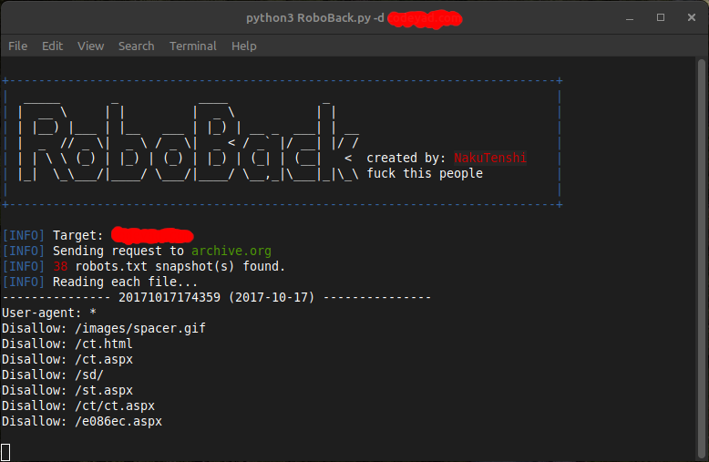
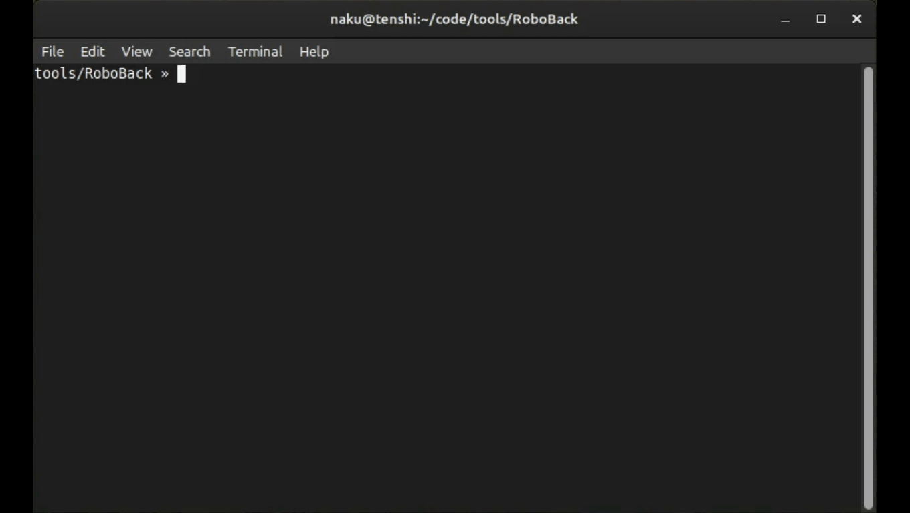

# 🤖 RoboBack




**RoboBack** is a command-line tool that allows you to **travel back in time** and extract historical `robots.txt` files of a target domain from [archive.org (Wayback Machine)](https://web.archive.org).

It can be useful for OSINT, bug bounty hunting, and understanding how a target's crawling policy evolved over time.

---

## 📦 Features

- Fetch historical `robots.txt` files from Wayback Machine
- Filter results by year(s)
- Save the extracted content to a file
- Colored output for better readability
- Clean and easy-to-use CLI interface

---

## 🧰 Usage

```bash
python3 RoboBack.py -d <domain> [options]
```

### 📌 Required Argument

- `-d <domain>`  
  The domain you want to scan (e.g., `example.com`)

### ⚙️ Optional Arguments

- `-o <file>`  
  Save the output to a file.

- `-tf <years>`  
  Filter by specific years (comma-separated), e.g., `2021,2022`

## 📥 Installation

```bash
git clone https://github.com/yourusername/RoboBack.git
cd RoboBack
pip install -r requirements.txt
```
  
## 🧠 Why Use RoboBack?

- Understand which parts of a site were previously disallowed
- Look for hidden directories or endpoints no longer in use
- Trace the history of domain structures and crawling behavior

---
**created by:** nakutenshi

به خدا نمیدونم دارم با زندگیم چی کار میکنم

حالم از این ادما بهم میخوره

طرز حرف زدنشون 

طرز تفکرشون

طرز قضاوت کردنشون

طرز رفتار کردنشون

راستشون بخوای فکر میکردم همه ادمو اینجورن

ولی یه دسته خاصیشون فرق داشتن

ولی من جزو به اون دسته نمیشدم

میخواستم هم نمیتونستم
